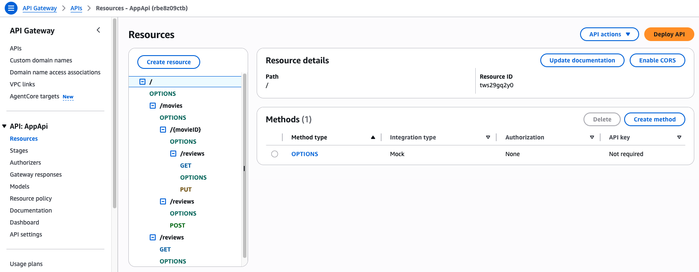
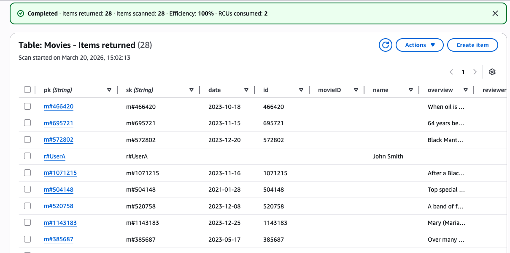
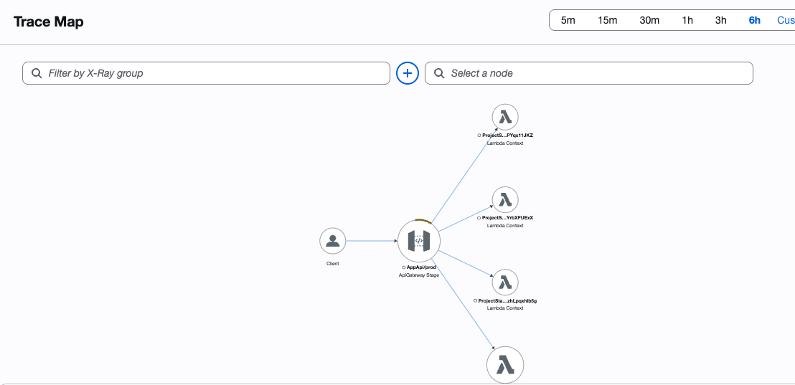
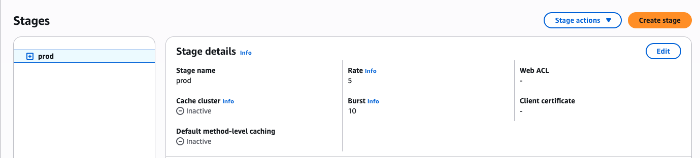
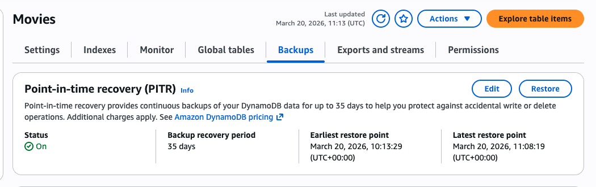
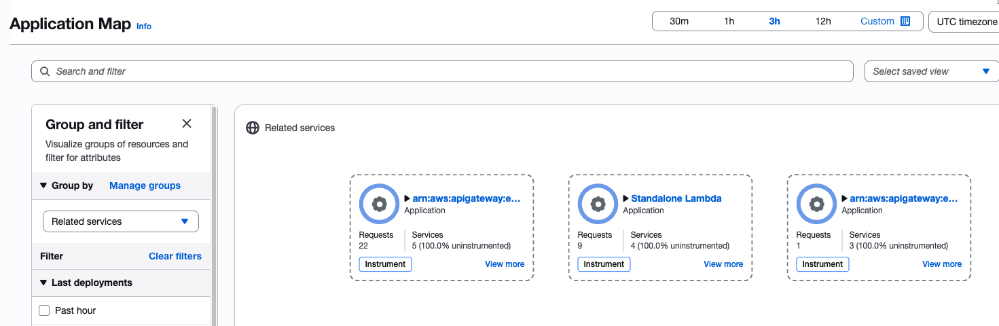

## Enterprise Web Development - Serverless REST Assignment.

**Student Name:** Jennefer Cullinan
**Student ID:** 20096634
**Demo** https://youtu.be/s3c1vm3l34w

### Screenshots.

A screenshot of the App Web API from the API Gateway management console

A screenshot of your seeded table from DynamoDB, e.g.

### Implementation Highlights (If relevant).

Briefly explain any non-standard features of your implementation, including (if relevant):

+ Restricted Review Update.
  In updateReview only the original author of a review can update the content. This is managed by comparing the verified identity of the logged in user from the Cognito token against the reviewerName stored in the DynamoDB table.
+ Dynamo LSI.
  Local secondary index on movies table using reviewerName as the sort key.
+ API Gateway validation.
  RequestValidator with strict json schema models for the auth-api and app-api. Also included a custom response for BadRequestBody as the default error wasn't giving enough info during a troubleshooting session (Content-Length required in header for app-api validator requests). Customised to include $context.error.validationErrorString, this was shown in operation in the demo video where more complete information is returned instead of just 'invalid request body'.
+ Other.
  + Shared Lambda layers, used in both auth and app api, centralises common types and utils, reducing deployment package size.
  + Data cleaning, removed the pk and sk from the user view return info, hiding the db layout from the user. Aslo mapped username to Cognito verified identity so that username is displayed on reviews instead of the Cognito UUIDs.

### Extra (If relevant).

State any other aspects of your solution that use CDK/serverless features not covered in the lectures

+ Distributed tracing with AWS X-Ray (observability)
  Implemented active X-Ray tracing for app-api. This allows devs to follow requests from beginning to end, showing the request journey. Helpful for troubleshooting and identifying bottlenecks. 
  
+ Api throttling & burst control. (security, traffic management)
  Added custom throttling limits (avg 5 requests per second with burst capacity at 10 requests). This gives protection against DDoS attacks and reduces cost overruns.
  
+ DynamoDB point in time recovery (PITR). (disaster recovery)
  Disaster recovery that provides the ability to restore the db to any point in time over the last 35 days.
  
+ CloudWatch application signals (reliability & health monitoring)
  Measure latency, errors and faults from the cw dashboard for system health and performance.
  

**Additional Notes from Student**
Students notes and links/references, history of work, issues and solutions used during the project.

Managing Lambda dependencies with layers
https://docs.aws.amazon.com/lambda/latest/dg/chapter-layers.html

Working with lambda layers & nodejs
https://docs.aws.amazon.com/lambda/latest/dg/nodejs-layers.html

Creating lambda layers with typescript & CDK
https://shawntorsitano.com/blog/cdk-lambda-layers/

**Problems & Troubleshooting auth app stack in Cognito demo app. Changes carried over to this project.**

tsconfig.json all changes commented in file
https://github.com/jencull/cognito-demo-app/blob/master/tsconfig.json

Update to resolve IDE errors 'resolveJsonModule' and 'esModuleInterop' are now required by TypeScript to bundle JSON schemas and handle modern module imports correctly. https://www.typescriptlang.org/tsconfig/#resolveJsonModule & microsoft/TypeScript#25400 Resolves "Cannot find module '../../shared/types.schema.json'. Consider using '--resolveJsonModule' to import module with '.json' extension." error in IDE in signup.ts

utils.ts all changes commented in file

imported StatementEffect, effct was set as a string but project using strict types for lambda. This sets the reponse to only accept 'allow' or 'deny' rather than something like 'maybe', which a string var would accept but AWS would not.

type mismatchs, importing the libraries resolved errors in IDE import jwt from 'jsonwebtoken' // npm i --save-dev @types/jsonwebtoken import jwkToPem from "jwk-to-pem"; // npm i --save-dev @types/jwk-to-pem

added 'as JwtToken' to end of return statement to enforce strict typing, resolve error in IDE return jwt.verify(token, pem, { algorithms: ["RS256"] }) as JwtToken;

**ProjectStack troubleshooting:**

Students laptop uses podman, not Docker. Run below in terminal window:

In order to deploy to AWS with podman run
CDK_DOCKER=podman npx cdk deploy

export CDK_DOCKER=podman (works for npx cdk synth)

npx cdk synth - builds project locally without sending anything to AWS. Very handy tool for troubleshooting.

Restart TS server - sync changes eg changes in paths, installing new packages.

**Testing auth lambdas**

Signup, use AuthServiceApiEndpoint, POST - working
https://xxxxxx.execute-api.eu-west-1.amazonaws.com/prod/auth/signup
body (raw)
{
"username": "userA",
"password": "passwA!1",
"email": "your_verified_email_identity"
}

Confirm signup, AuthServiceApiEndpoint, POST - working
https://xxxxxxxx.execute-api.eu-west-1.amazonaws.com/prod/auth/confirm-signup

{
"username": "userA",
"code": "your_verification_code"
}

Signin, AuthServiceApiEndpoint, POST - working
https://xxxxxxxx.execute-api.eu-west-1.amazonaws.com/prod/auth/signin

{
"username": "userA",
"password": "passwA!1"
}

Signout, AuthServiceApiEndpoint, GET - working
https://xxxxxxxx.execute-api.eu-west-1.amazonaws.com/prod/auth/signout

**Testing app api lambdas**

Get all reviews for a movie (public) - app api endpoint - working
https://xxxxxx.execute-api.eu-west-1.amazonaws.com/prod/movies/848326/reviews

Get all reviews for a specific movie for 2024 or 2024-03 or 2-24-02-10 - app api endpoint - working
https://xxxxxx.execute-api.eu-west-1.amazonaws.com/prod/reviews?movie=572802&published=2024
returns error if either movieID or date is missing.

Add review - POST - app api endpoint - working
https://xxxxxx.execute-api.eu-west-1.amazonaws.com/prod/movies/reviews

1. sign into app using auth api url
2. copy cookie
3. paste cookie into header of POST request for review Postman-Token, Host & Cookie options selected
4. 19th March - need Content-Length in header also when using API Gateway Validation

   {
   "movieID": 848326,
   "date": "2026-03-13",
   "text": "I am testing my add review function!"
   }

Update review - PUT - app api url - working
https://xxxxxx.execute-api.eu-west-1.amazonaws.com/prod/movies/848326/reviews
Same requirements as above, postman-token, host and cookie
{
"movieID": 848326,
"date": "2026-03-13",
"text": "I am testing my add review function! Now I am testing my update function"
}

**API Validation**

Request validation :

1. performance improvement, info checks done before reaching lambda and user advised of error sooner
2. reduces costs as lamdba not invoked if there is an error.

https://docs.aws.amazon.com/apigateway/latest/developerguide/api-gateway-request-validation-set-up.html
https://docs.aws.amazon.com/apigateway/latest/api/API_RequestValidator.html
https://docs.aws.amazon.com/cdk/api/v2/docs/aws-cdk-lib.aws_apigateway.Model.html
https://docs.aws.amazon.com/cdk/api/v2/docs/aws-cdk-lib.aws_apigateway.RequestValidator.html

Response validation not implemented as it adds latency and would not work for the performace aspect outlined in the project spec. In a production system it should be implemented as it helps prevent data leaks.

https://docs.aws.amazon.com/cdk/api/v2/docs/aws-cdk-lib.aws_apigateway.Model.html

**Testing API Gateway valdiation**

Signin - fails, as expected
https://xxxxxx.execute-api.eu-west-1.amazonaws.com/prod/auth/signin
{
"email": "userA", // key should be username
"password": "passwA!1"
}

Signup - fails, as expected
https://xxxxxx.execute-api.eu-west-1.amazonaws.com/prod/auth/signup
{
"username": "userC",
"password": "1234" // pw has to be > 8 char
}

add review - fails, as expected
https://xxxxxx.execute-api.eu-west-1.amazonaws.com/prod/movies/reviews
Need Cookie,
{
"movieID": 91011, // invalid id
"date": "2024-03-16",
"text": "Great scenery"
}

update review - fails as expected
https://xxxxxx.execute-api.eu-west-1.amazonaws.com/prod/movies/notanumber/reviews //invalid movie id in url
{
"movieID": 848326,
"date": "2024-03-16",
"text": "Great scenery."
}
and this one, to test the min 1 char for review
https://xxxxxx.execute-api.eu-west-1.amazonaws.com/prod/movies/848326/reviews
{
"movieID": 848326,
"date": "2024-03-16",
"text": ""
}

In order for API gateway validation to work on addReview and updateReview have to use the Content-Length option in header info.

return info for reviews was 'cleaned' to not show the pk & sk to the user.
